# Workshop ProgAlgo -  effets d'images
--------
Avant toute chose, je tiens à préciser que j'ai oublié de commit le mercredi et le jeudi car je n'ai pas eu le réflexe. Je n'avais sauvegardé qu'en local. J'espère que ça ne posera pas problème.

### Ne garder que le vert ⭐


<div style="display: flex; justify-content: space-between; gap: 10px;">
 <div>
    
    <p style="text-align: center;">Avant</p>
 </div>

 <div>
    
    <p style="text-align: center;">Après</p>
 </div>
</div>

### Échanger les canaux ⭐


<div style="display: flex; justify-content: space-between; gap: 10px;">
 <div>
    
    <p style="text-align: center;">Avant</p>
 </div>

 <div>
    
    <p style="text-align: center;">Après</p>
 </div>
</div>

### Noir & Blanc ⭐


<div style="display: flex; justify-content: space-between; gap: 10px;">
 <div>
    
    <p style="text-align: center;">Avant</p>
 </div>

 <div>
    
    <p style="text-align: center;">Après</p>
 </div>
</div>

### Négatif ⭐


<div style="display: flex; justify-content: space-between; gap: 10px;">
 <div>
    
    <p style="text-align: center;">Avant</p>
 </div>

 <div>
    
    <p style="text-align: center;">Après</p>
 </div>
</div>

### Dégradé ⭐


 <div>
    
 </div>

### Miroir ⭐⭐


<div style="display: flex; justify-content: space-between; gap: 10px;">
 <div>
    
    <p style="text-align: center;">Avant</p>
 </div>

 <div>
    
    <p style="text-align: center;">Après</p>
 </div>
</div>

### Image bruitée ⭐⭐


<div style="display: flex; justify-content: space-between; gap: 10px;">
 <div>
    
    <p style="text-align: center;">Avant</p>
 </div>

 <div>
    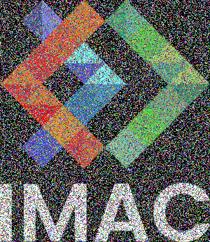
    <p style="text-align: center;">Après</p>
 </div>
</div>

Remarque : l'intensité du bruit est réglée ainsi :

```cpp
int choice {random_int(0, 2)}; // random_int(MIN, MAX+1)

        if (choice == 1) // dans ce cas, le pixel est remplacé
        {
            // choix aléatoire de la couleur :
            color.g = random_float(0.f, 1.f); // random_float(MIN, MAX)
            color.b = random_float(0.f, 1.f);
            color.r = random_float(0.f, 1.f);
        }
```

### Rotation de 90° ⭐⭐


<div style="display: flex; justify-content: space-between; gap: 10px;">
 <div>
    
    <p style="text-align: center;">Avant</p>
 </div>

 <div>
    
    <p style="text-align: center;">Après</p>
 </div>
</div>


Remarque : ici la rotation est dans le sens direct grâce à cette formule

```cpp
image_rotated.pixel(image.height() - 1 - y, x) = image.pixel(x,y); // rotation dans le sens direct
```

Pour le sens indirect, on aurait utilisé cette formule :

```cpp
image_rotated.pixel(y, image.width() - 1 - x) = image.pixel(x,y); // rotation dans le sens indirect
```

### RGB split ⭐⭐


<div style="display: flex; justify-content: space-between; gap: 10px;">
 <div>
    
    <p style="text-align: center;">Avant</p>
 </div>

 <div>
    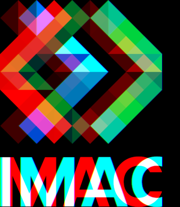
    <p style="text-align: center;">Après</p>
 </div>
</div>

Remarque : contrôle de l'effet grâce à la variable `pixel_gap`

```cpp 
const int pixel_gap {30}; // j'ai créé cette variable pour pouvoir changer facilement le décalage de pixels
    // plus pixel_gap est petit, plus l'effet est subtile
```

###  Luminosité ⭐⭐


<div style="display: flex; justify-content: space-between; gap: 5px;">
 <div>
    
    <p style="text-align: center;">Originale</p>
 </div>

 <div>
    
    <p style="text-align: center;">Assombrissement</p>
 </div>

 <div>
    
    <p style="text-align: center;">Éclaircissement</p>
 </div>
</div>

Remarque : contrôle des effets grâce à la variable `p`, l'exposant

```cpp 
// cas assombrissemnt : 
const float p {1.5}; // plus p est grand, plus les couleurs sont assombrie

// cas éclaircissement : 
 const float p {0.5}; // plus p est petit, plus les couleurs sont éclaircies

```

### Disque ⭐⭐(⭐)


 <div>
    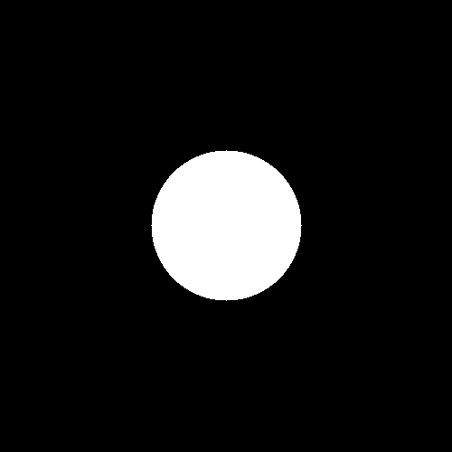
 </div>

### Cercle ⭐


 <div>
    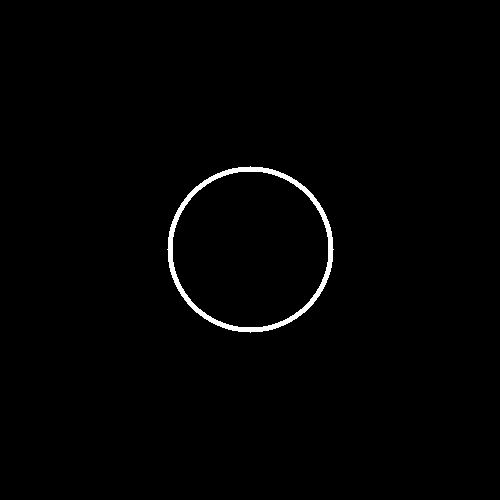
 </div>

Remarque : contrôle de l'épaisseur du trait grâce à la variable `thickness`

```cpp 
const int thickness {5}; // épaisseur des traits du cercle
```


### Animation ⭐⭐


 <div>
    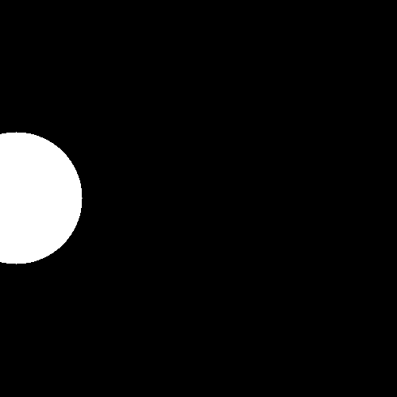
 </div>

### Rosace ⭐⭐⭐


 <div>
    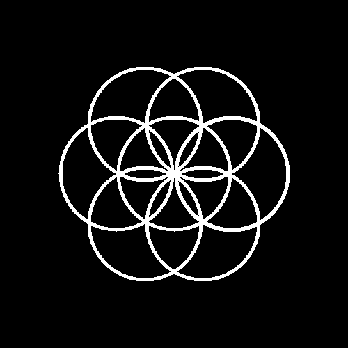
 </div>

Remarque : obtention des différents cercles

```cpp 
circle(image, x_center, y_center); // cercle central

// autres cercles : 
for (float teta {0}; teta < 2*pi ; teta += pi/3)
   {
      circle(image, x_center + radius*glm::cos(teta), y_center + radius*glm::sin(teta)); // coordonnées des nouveaux centres obtenus avec la trigo
   }
```

### Mosaïque ⭐⭐


 <div>
    
 </div>

Remarque : on obtient les coordonnées du coin gauche supérieur des carreaux (nouveau point de départ à chaque fois pour le motif) ainsi 

```cpp 
// coordonnées du coin gauche supérieur du carreau :
int start_tile_x {x*image.width()};
int start_tile_y {y*image.height()};
```


### Mosaïque miroir ⭐⭐⭐⭐


 <div>
    
 </div>

_Remarque : pour réaliser les différents miroirs (vertical et horizontal), j'ai créé plusieurs fonctions `mirror_return` et `horizontal_mirror_return` où la première est la même que celle implémentée pour l'exercice miroir sauf que celle-ci renvoie l'image au lieu de simplement la modifier_

**Remarque : le choix de la version de l'image pour chaque carreau se fait suivant la parité des indices de lignes et colonnes de l'image**

```cpp 
// choix de l'image à afficher dans le carreau de la mosaique en fonction de la parité de l'indice de la ligne et/ou de la colonne :
if (i%2 != 0 && j%2 != 0)
{
   choice = horizontal_mirror_of_vertical_mirror;
}
else if (j%2 != 0)
{
   choice = horizontal_mirror;
}
else if (i%2 != 0)
{
   choice = vertical_mirror;
}
else
{
   choice = image;
}
```

### Glitch ⭐⭐⭐


<div style="display: flex; justify-content: space-between; gap: 10px;">
 <div>
    
    <p style="text-align: center;">Avant</p>
 </div>

 <div>
    
    <p style="text-align: center;">Après</p>
 </div>
</div>

**Explication brève : je génère `nb_rectangles` rectangles de dimensions et positions aléatoires et je les swap entre eux**

Remarque : l'intensité de l'effet se contrôle à l'aide de la variable `nb_rectangles`

```cpp 
const int nb_rectangles {100}; // contrôle le nombre de rectangles ie l'ampleur du glitch : plus nb_rectangles est grand, plus l'effet est accentué
```

###  Tri de pixels ⭐⭐⭐


<div style="display: flex; justify-content: space-between; gap: 10px;">
 <div>
    
    <p style="text-align: center;">Avant</p>
 </div>

 <div>
    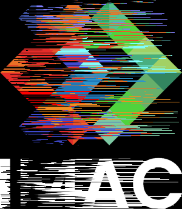
    <p style="text-align: center;">Après</p>
 </div>
</div>

**Explication brève : pour chaque ligne de l'image, je choisi aléatoirement une sous-liste de pixels de la ligne que je trie par couleur**

Remarque : l'intensité de l'effet se contrôle à l'aide de la variable `left_gap`

```cpp 
const int left_gap {6}; // plus left_gap est grand, plus image.width()/left_gap est petit et donc plus les indices de début pour le choix des sous listes de pixels à trier auront de chance d'être petit i.e. plus la sous-liste sera proche du bord gauche de l'image, pour chaque ligne
```


### Fractale de Mandelbrot ⭐⭐⭐(⭐)


 <div>
    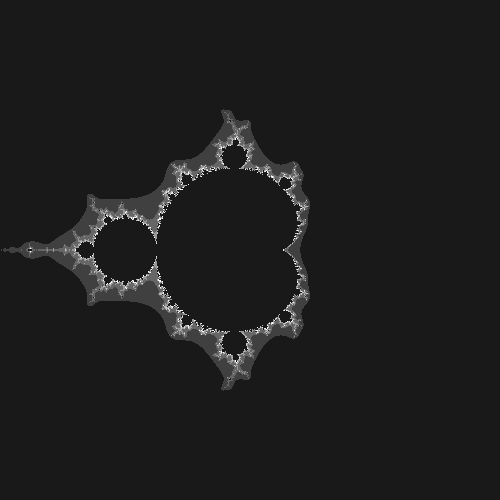
 </div>

*Remarque : Je n'ai pas été au bout du dégradé de couleurs de la fractale* 

Remarque : le nombre maximum d'itérations pour l'étude de l'évolution de z est donné par la variable `max_iter`

```cpp 
const int max_iter {100}; // nb maximum d'itérations pour le calcul de z
```


### Dégradés dans l'espace de couleur Lab ⭐⭐⭐(⭐)

<div style="display: flex; justify-content: space-between; gap: 10px;">
 <div>
    
    <p style="text-align: center;">Premier dégradé en couleurs dans l'espace sRGB</p>
 </div>

 <div>
    
    <p style="text-align: center;">Dégradé en couleurs amélioré dans l'espace Ok Lab</p>
 </div>
</div>

_Remarque : Pour réaliser les différentes conversions, j'ai crée plusieurs fonctions `sRGB_to_linearRGB`, `linearRGB_to_sRGB`, `sRGB_to_linearRGB_color`, `linearRGB_to_sRGB_color`, `linearRGB_to_oklab`, `oklab_to_linearRGB`, `oklab_gradation` et enfin `color_gradation_enhanced`_

### Tramage ⭐⭐⭐(⭐)

<div style="display: flex; justify-content: space-between; gap: 10px;">
 <div>
    
    <p style="text-align: center;">Avant</p>
 </div>

 <div>
    
    <p style="text-align: center;">Après</p>
 </div>
</div>

### Normalisation de l'histogramme ⭐⭐⭐(⭐)

<div style="display: flex; justify-content: space-between; gap: 10px;">
 <div>
    
    <p style="text-align: center;">Avant</p>
 </div>

 <div>
    
    <p style="text-align: center;">Après</p>
 </div>
</div>

### Vortex ⭐⭐⭐⭐

<div style="display: flex; justify-content: space-between; gap: 10px;">
 <div>
    
    <p style="text-align: center;">Avant</p>
 </div>

 <div>
    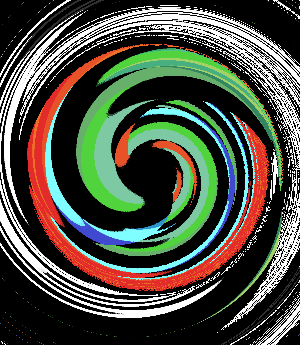
    <p style="text-align: center;">Après</p>
 </div>
</div>

Remarque : j'ai donné une valeur de base à l'angle de rotation `angle`

```cpp 
float angle {5}; // valeur d'angle de début
```

Puis, pour chaque point, la nouvelle valeur d'angle est proportionnelle à la distance au centre du vortex (qui est aussi le centre de l'image)

```cpp 
angle = distance_to_center*0.05f; // rotation proportionnelle à la distance au centre du vortex
```

### Convolutions ⭐⭐⭐⭐

J'ai codé une fonction de convolution pour des matrices 3*3 quelconques. 

Voici ce que cela donne avec différents kernels : 
<div style="display: flex; justify-content: space-between; gap: 10px;">
 <div>
    
    <p style="text-align: center;">Sharpen convolution</p>
 </div>

 <div>
    
    <p style="text-align: center;">Blur convolution</p>
 </div>
</div>

<div style="display: flex; justify-content: space-between; gap: 10px;">
 <div>
    
    <p style="text-align: center;">Emboss convolution</p>
 </div>

 <div>
    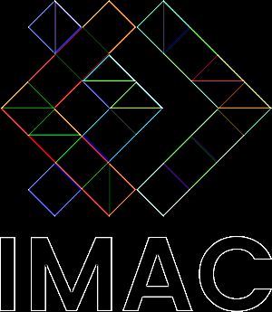
    <p style="text-align: center;">Outline convolution</p>
 </div>
</div>

### K-means ⭐⭐⭐⭐⭐
 
Les problèmes que j'ai rencontré pour l'implémentation de cet algorithme sont : 
* La gestion des coordonnées : initialement je ne travaillais que sur les valeurs des couleurs pour appliquer l'algorithme dessus mais, quand j'ai dû remplacer les couleurs de l'image par les nouvelles obtenues, je me suis rendue compte qu'il me manquait les coordonnées du coup j'ai créé un autre `std::vector`, `cluster_elt_positions`, qui sauvegarde les coordonnées des pixels des clusters dans le même ordre que leur classification
 
* La gestion de la réinitialisation des tableaux de clusters `clusters` et de positions des pixels `cluster_elt_positions` à chaque tour de boucle `while` : comme j'utilise des `std::vector` je n'ai pas de taille prédéfinie or j'avais besoin d'avoir une taille pour les `clear` du coup j'ai utilisé `.resize()` (mon idée initiale était d'utilisé des `std::array` comme l'on sait que les tableaux seront de taille `k` mais impossible car k n'est pas connu à la compilation)
  

<div style="display: flex; justify-content: space-between; gap: 10px;">
 <div>
    
    <p style="text-align: center;">Avant</p>
 </div>

 <div>
    
    <p style="text-align: center;">k = 3</p>
 </div>

  <div>
    
    <p style="text-align: center;">k = 5</p>
 </div>
</div>

-------
# Explorations personnelles : 

En essayant de coder la fonction glitch, j'ai au début obtenu cet effet que je trouve très stylé : 
<div>
    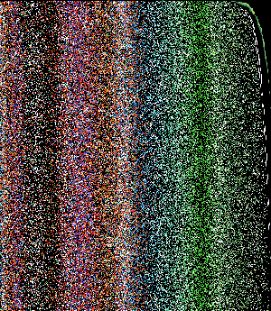
</div>

J'ai aussi testé l'effet de pixel sort sur une photo que j'avais prise et je trouve que ça rend super bien : 

<div>
    
</div>
